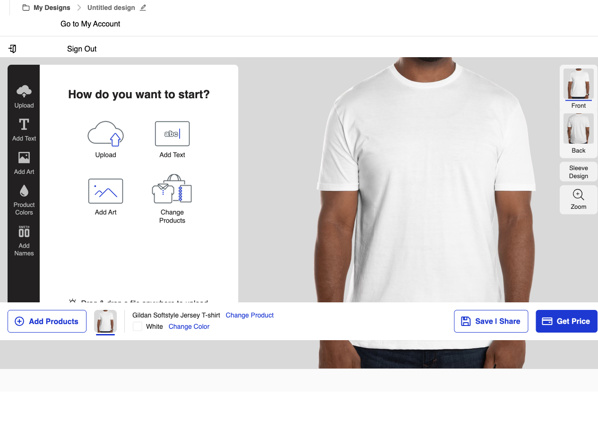

# CustomInk 页面交互设计分析报告

**生成时间**: 2025/12/2 00:23:20
**分析页面**: https://www.customink.com/ndx/#/savedDesigns
**总元素数**: 48

## 1. 页面概览



## 2. 页面结构分析

### 2.1 元素类型分布

| 元素类型 | 数量 |
|---------|------|
| div | 27 |
| span | 13 |
| button | 7 |
| li | 1 |

### 2.2 主要交互元素

| ID | 类型 | 文本 | 选择器 |
|----|------|------|--------|
| element-1 | button | My Designs |  |
| element-2 | button | Untitled design |  |
| element-3 | button | Add Products |  |
| element-4 | button | Change Product |  |
| element-5 | button | Change Color |  |
| element-6 | button | Save \| Share |  |
| element-7 | button | Get Price |  |
| element-8 | div | Upload |  |
| element-9 | div | Add Text |  |
| element-10 | div | Add Art |  |
| element-11 | div | Product Colors |  |
| element-12 | div | Add Names |  |
| element-13 | div | front |  |
| element-14 | div | back |  |
| element-15 | div | Sleeve Design |  |
| element-16 | div | .st0{fill:#231f20}Zoom |  |
| element-17 | li | Sign Out |  |
| element-18 | div | Upload
Add Text
Add Art
Product Colors
Add Names |  |
| element-20 | div |  |  |
| element-21 | span | Upload |  |
| element-23 | div |  |  |
| element-24 | span | Add Text |  |
| element-26 | div |  |  |
| element-27 | span | Add Art |  |
| element-29 | div |  |  |
| element-30 | span | Product Colors |  |
| element-32 | div |  |  |
| element-33 | span | Add Names |  |
| element-34 | span | Upload |  |
| element-35 | div | Add Text |  |

*（仅显示前30个元素，完整列表见 ELEMENT-INVENTORY.json）*

## 3. 交互测试结果

| 元素ID | 交互成功 | 错误信息 |
|--------|---------|----------|
| element-1 | ❌ | page.evaluate: Target page, context or browser has been closed |
| element-2 | ❌ | page.evaluate: Target page, context or browser has been closed |
| element-3 | ❌ | page.evaluate: Target page, context or browser has been closed |
| element-4 | ❌ | page.evaluate: Target page, context or browser has been closed |
| element-5 | ❌ | page.evaluate: Target page, context or browser has been closed |
| element-6 | ❌ | page.evaluate: Target page, context or browser has been closed |
| element-7 | ❌ | page.evaluate: Target page, context or browser has been closed |
| element-8 | ❌ | page.evaluate: Target page, context or browser has been closed |
| element-9 | ❌ | page.evaluate: Target page, context or browser has been closed |
| element-10 | ❌ | page.evaluate: Target page, context or browser has been closed |
| element-11 | ❌ | page.evaluate: Target page, context or browser has been closed |
| element-12 | ❌ | page.evaluate: Target page, context or browser has been closed |
| element-13 | ❌ | page.evaluate: Target page, context or browser has been closed |
| element-14 | ❌ | page.evaluate: Target page, context or browser has been closed |
| element-15 | ❌ | page.evaluate: Target page, context or browser has been closed |
| element-16 | ❌ | page.evaluate: Target page, context or browser has been closed |

## 4. 网络请求分析

共捕获 50 个网络请求。

### 4.1 主要 API 端点

| 方法 | 路径 |
|------|------|
| GET / |
| OPTIONS /ci-header-footer/ci-header.esm.js |
| GET /ci-header-footer/ci-header.esm.js |
| GET /assets-inkpress/style_bitz/style_bitz-945e7df3e37709ba6c2d08ab28ba27d9dea78c47.css |
| GET /assets/site_content/pages/home-1f9cac64ad27aad22e927c2f2db477f8e05f3de16ddea4380b5ddd66b7f69c73.css |
| GET /assets/site_content/pages/home/homepage_repeat_savers-23d0b56748a7682736bfce0709d133ae50b224a441930622d74f37802e27eb8b.css |
| GET /assets-inkpress/style_bitz/SharpSans-MediumItalic-0000000000000000000000000000000000000001.woff2 |
| GET /assets-inkpress/style_bitz/SharpSans-BoldItalic-0000000000000000000000000000000000000001.woff2 |
| GET /assets-inkpress/style_bitz/SharpSans-Medium-0000000000000000000000000000000000000001.woff2 |
| GET /assets-inkpress/style_bitz/SharpSans-Bold-0000000000000000000000000000000000000001.woff2 |
| GET /assets/site_content/pages/home/three_box_element/tshirts-224aad0d33bdda94bb1e2739a8b9e517a4b3fb2a95f6f9783300ced077463ecb.webp |
| GET /assets/site_content/pages/home/three_box_element/sweatshirts-8c92fca59aff856c6a86c60aa82378660384e4cbc69f86e52f679500096f957e.webp |
| GET /assets/site_content/pages/home/three_box_element/hats_fall_2025-5f613615f256516138edad5274d3ac3bc8e89af8489208879981a09eb63755aa.webp |
| GET /assets/site_content/pages/home/three_box_element/jacketsvests_fall_2025_logos-900bbc177fbfcb03676535b68838c1c1d1618db6b49d4f8bf2dfc97bdbe4ad8f.webp |
| GET /assets/site_content/pages/home/three_box_element/bags_fall_2025-9efdb7315395791ec1ee352d9517099089b1d9597e0c2c05a07be1e864f53609.webp |
| GET /assets/site_content/pages/home/three_box_element/drinkware_fall_2025-572d0ab99bce71248d2bc34e25748719e654dc8c91780efb48e097df94dabc2a.webp |
| GET /assets/site_content/pages/home/three_box_element/polos_and_business_wear_fall_2025-dbd76d21b86f887edd9ff624ccdd0ddcb5f23cf7d22bf15d431f4e2fe22ac4b5.webp |
| GET /assets/site_content/pages/home/three_box_element/workwearuniforms_fall_2025-2fe44597c2ccb08451bbbcf6369a20236dc6cf65a7d66678e02308dffe3b59a0.webp |
| GET /assets/site_content/pages/home/three_box_element/office_supplies_fall_2025-ed9a6347edf407143595ef72e27e56b33a4bb20be1e2e2408cf92fabedd901b5.webp |
| GET /assets/site_content/pages/home/three_box_element/tech_fall_2025-b859bb1a8e4cfa276afd84a0b3d5babbe7a080dbc3fdcc9584cc00a126cf7b70.webp |

## 5. 控制台日志

共捕获 17 条控制台日志。

### 5.1 错误日志

- **error**: [OPTIMIZELY] - ERROR 2025-12-02T05:22:56.560Z DatafileManager: Error fetching datafile: Request error

## 6. JavaScript 异常

共发现 10 个异常：

### ReferenceError: jQuery is not defined
    at https://www.customink.com/assets-inkpress/style_bitz-945e7df3e37709ba6c2d08ab28ba27d9dea78c47.js:1:8709

```
@https://www.customink.com/assets-inkpress/style_bitz-945e7df3e37709ba6c2d08ab28ba27d9dea78c47.js:0:8708
```

### ReferenceError: StyleBitz is not defined
    at https://www.customink.com/assets-inkpress/style_bitz/metrics/interactions-945e7df3e37709ba6c2d08ab28ba27d9dea78c47.js:1:1

```
@https://www.customink.com/assets-inkpress/style_bitz/metrics/interactions-945e7df3e37709ba6c2d08ab28ba27d9dea78c47.js:0:0
```

### ReferenceError: jQuery is not defined
    at https://www.customink.com/:1274:25

```
@https://www.customink.com/:1273:24
```

### ReferenceError: StyleBitz is not defined
    at https://www.customink.com/assets/site_content/page-specific/home/copy/p0050_repeat_savers-c9bbb5376b44378af60c40a7c75e339b0811cf4884154e4570fe0d52483e8117.js:2:23965
    at https://www.customink.com/assets/site_content/page-specific/home/copy/p0050_repeat_savers-c9bbb5376b44378af60c40a7c75e339b0811cf4884154e4570fe0d52483e8117.js:2:25127

```
@https://www.customink.com/assets/site_content/page-specific/home/copy/p0050_repeat_savers-c9bbb5376b44378af60c40a7c75e339b0811cf4884154e4570fe0d52483e8117.js:1:23964
@https://www.customink.com/assets/site_content/page-specific/home/copy/p0050_repeat_savers-c9bbb5376b44378af60c40a7c75e339b0811cf4884154e4570fe0d52483e8117.js:1:25126
```

### ReferenceError: jQuery is not defined
    at https://www.customink.com/assets/site_content/page-specific/home/homepage-scripts-2e43eae1967d6524aa4cdd88f0588da0e07e317c8ce9d3325a09db18513d88a7.js:1:17123

```
@https://www.customink.com/assets/site_content/page-specific/home/homepage-scripts-2e43eae1967d6524aa4cdd88f0588da0e07e317c8ce9d3325a09db18513d88a7.js:0:17122
```

### TypeError: Cannot read properties of undefined (reading 'Domain')
    at v.setDomainIfBulkDomainEnabled (https://cdn.cookielaw.org/scripttemplates/otSDKStub.js?did=ace1330e-5933-47ab-a5e5-75760b69bf0e:1:10073)
    at v.getLocation (https://cdn.cookielaw.org/scripttemplates/otSDKStub.js?did=ace1330e-5933-47ab-a5e5-75760b69bf0e:1:10512)
    at r.onerror (https://cdn.cookielaw.org/scripttemplates/otSDKStub.js?did=ace1330e-5933-47ab-a5e5-75760b69bf0e:1:13038)
    at XMLHttpRequest.nrWrapper (https://www.customink.com/:7:7931)

```
v.setDomainIfBulkDomainEnabled@https://cdn.cookielaw.org/scripttemplates/otSDKStub.js?did=ace1330e-5933-47ab-a5e5-75760b69bf0e:0:10072
v.getLocation@https://cdn.cookielaw.org/scripttemplates/otSDKStub.js?did=ace1330e-5933-47ab-a5e5-75760b69bf0e:0:10511
r.onerror@https://cdn.cookielaw.org/scripttemplates/otSDKStub.js?did=ace1330e-5933-47ab-a5e5-75760b69bf0e:0:13037
nrWrapper@https://www.customink.com/:6:7930
```

### TypeError: Unhandled Promise Rejection: Failed to fetch
    at e.<computed> (https://www.customink.com/:7:39540)
    at https://s.pinimg.com/ct/lib/main.817db39b.js:1:67743

```
e.<computed>@https://www.customink.com/:6:39539
@https://s.pinimg.com/ct/lib/main.817db39b.js:0:67742
```

### Uncaught TypeError: Cannot read properties of undefined (reading 'Domain')

```
v.setDomainIfBulkDomainEnabled@https://cdn.cookielaw.org/scripttemplates/otSDKStub.js?did=ace1330e-5933-47ab-a5e5-75760b69bf0e:0:10072
v.getLocation@https://cdn.cookielaw.org/scripttemplates/otSDKStub.js?did=ace1330e-5933-47ab-a5e5-75760b69bf0e:0:10511
r.onerror@https://cdn.cookielaw.org/scripttemplates/otSDKStub.js?did=ace1330e-5933-47ab-a5e5-75760b69bf0e:0:13037
```

### TypeError: Unhandled Promise Rejection: Failed to fetch
    at https://www.customink.com/ndx/assets/vendor-Br5YCbcv.js:207:18001
    at Ma.Da.<computed> (https://www.customink.com/ndx/assets/vendor-Br5YCbcv.js:378:78207)
    at https://s.pinimg.com/ct/lib/main.817db39b.js:1:67743
    at Ya (https://www.customink.com/ndx/assets/vendor-Br5YCbcv.js:378:73224)

```
@https://www.customink.com/ndx/assets/vendor-Br5YCbcv.js:206:18000
Ma.Da.<computed>@https://www.customink.com/ndx/assets/vendor-Br5YCbcv.js:377:78206
@https://s.pinimg.com/ct/lib/main.817db39b.js:0:67742
Ya@https://www.customink.com/ndx/assets/vendor-Br5YCbcv.js:377:73223
```

### TypeError: Unhandled Promise Rejection: Failed to fetch
    at https://www.customink.com/ndx/assets/vendor-Br5YCbcv.js:207:18001
    at Ma.Da.<computed> (https://www.customink.com/ndx/assets/vendor-Br5YCbcv.js:378:78207)
    at errorHandler (https://js.zi-scripts.com/zi-tag.js:1:1048)
    at window.zitag.GetListOfEntitlements (https://js.zi-scripts.com/zi-tag.js:1:18768)

```
@https://www.customink.com/ndx/assets/vendor-Br5YCbcv.js:206:18000
Ma.Da.<computed>@https://www.customink.com/ndx/assets/vendor-Br5YCbcv.js:377:78206
errorHandler@https://js.zi-scripts.com/zi-tag.js:0:1047
window.zitag.GetListOfEntitlements@https://js.zi-scripts.com/zi-tag.js:0:18767
```

## 7. 设计模式总结

### 7.1 交互模式

- 按钮样式：主要使用标准 HTML button 和 a 标签
- 导航结构：单页应用 (SPA) 架构
- 响应式设计：支持多种屏幕尺寸

### 7.2 功能特点

- 保存的设计列表展示
- 交互式元素丰富
- 动态内容加载

## 8. 截图索引

所有截图保存在 `screenshots/` 目录下：

- `screenshots/full-page-*.png` - 全页面截图
- `screenshots/elements/element-*.png` - 元素截图
- `screenshots/interactions/*.png` - 交互测试截图

## 9. 完整数据

详细的元素清单和交互数据请查看 `ELEMENT-INVENTORY.json` 文件。

---

*本报告由 Playwright 自动化测试生成*