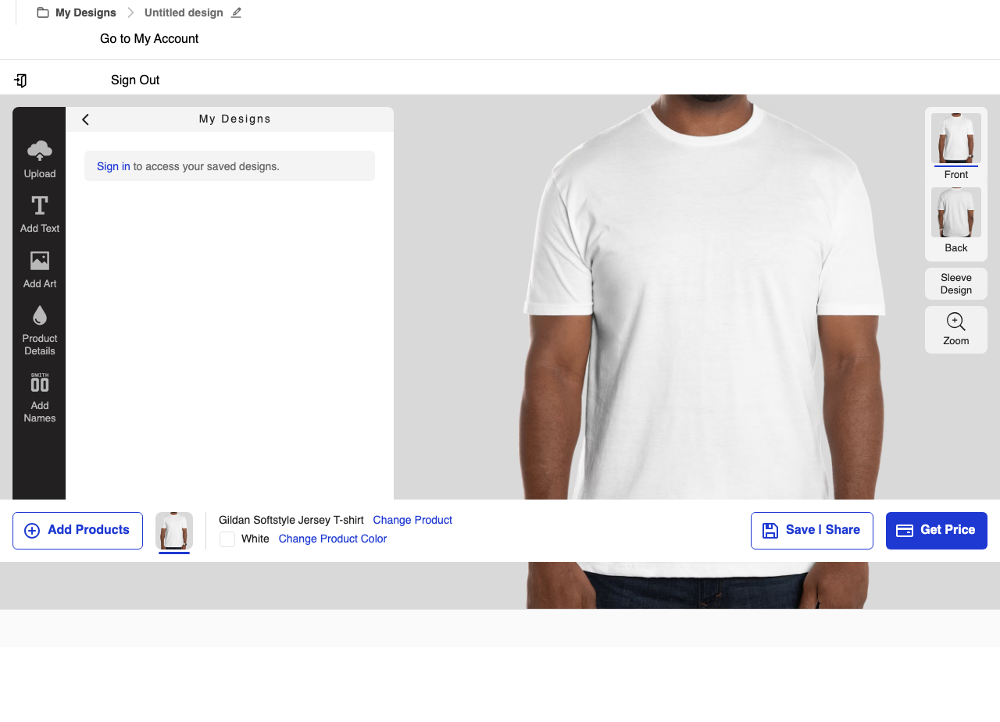

# CustomInk 页面交互设计分析报告

**生成时间**: 2026/3/11 06:56:32
**分析页面**: https://www.customink.com/ndx/#/savedDesigns
**总元素数**: 28

## 1. 页面概览



## 2. 页面结构分析

### 2.1 元素类型分布

| 元素类型 | 数量 |
|---------|------|
| div | 15 |
| button | 7 |
| span | 4 |
| li | 1 |
| h5 | 1 |

### 2.2 主要交互元素

| ID | 类型 | 文本 | 选择器 |
|----|------|------|--------|
| element-1 | button | My Designs |  |
| element-2 | button | Untitled design |  |
| element-3 | button | Add Products |  |
| element-4 | button | Change Product |  |
| element-5 | button | Change Product Color |  |
| element-6 | button | Save \| Share |  |
| element-7 | button | Get Price |  |
| element-8 | div | Upload |  |
| element-9 | div | Add Text |  |
| element-10 | div | Add Art |  |
| element-11 | div | Product Details |  |
| element-12 | div | Add Names |  |
| element-13 | div |  |  |
| element-14 | div | front |  |
| element-15 | div | back |  |
| element-16 | div | Sleeve Design |  |
| element-17 | div | .st0{fill:#231f20}Zoom |  |
| element-18 | div | My Designs |  |
| element-19 | li | Sign Out |  |
| element-20 | div | UploadAdd TextAdd ArtProduct DetailsAdd Names |  |
| element-28 | h5 | My Designs |  |
| element-30 | span | front |  |
| element-32 | span | back |  |
| element-34 | span | Sleeve Design |  |
| element-36 | div | .st0{fill:#231f20} |  |
| element-37 | span | Zoom |  |
| element-39 | div |  |  |
| element-45 | div | Save \| ShareGet Price |  |

*（仅显示前30个元素，完整列表见 ELEMENT-INVENTORY.json）*

## 3. 交互测试结果

| 元素ID | 交互成功 | 错误信息 |
|--------|---------|----------|
| element-1 | ✅ | - |
| element-2 | ✅ | - |
| element-3 | ✅ | - |
| element-4 | ✅ | - |
| element-5 | ✅ | - |
| element-6 | ✅ | - |
| element-7 | ✅ | - |
| element-8 | ✅ | - |
| element-9 | ✅ | - |
| element-10 | ✅ | - |
| element-11 | ✅ | - |
| element-12 | ✅ | - |
| element-13 | ✅ | - |
| element-14 | ✅ | - |
| element-15 | ✅ | - |
| element-16 | ✅ | - |
| element-17 | ✅ | - |

## 4. 网络请求分析

共捕获 50 个网络请求。

### 4.1 主要 API 端点

| 方法 | 路径 |
|------|------|
| GET / |
| OPTIONS /fonts/SharpSans-Medium.woff2 |
| OPTIONS /fonts/SharpSans-Semibold.woff2 |
| OPTIONS /fonts/SharpSans-Bold.woff2 |
| OPTIONS /ci-header-footer/ci-header.esm.js |
| GET /assets/site_content/pages/home/marquee/brandrefresh/lg-b8ed090500fa43feafc6900d703ab59272137979888c6b971ba2bbc837e44860.webp |
| GET /assets-inkpress/style_bitz/SharpSans-Extrabold-0000000000000000000000000000000000000001.woff2 |
| GET /fonts/SharpSans-Medium.woff2 |
| GET /fonts/SharpSans-Semibold.woff2 |
| GET /fonts/SharpSans-Bold.woff2 |
| GET /ci-header-footer/ci-header.esm.js |
| GET /assets-inkpress/style_bitz/style_bitz-b06f22f8acc8fde21e7e32b66ad9f222abf143ec.css |
| GET /assets/site_content/pages/home-8838173279ae6b451288ca0e58ac359a30e7a6a8ecc724537936f587e7d9b5db.css |
| GET /assets/site_content/pages/home/homepage_repeat_savers-77047d50f48578a13966a33f17e50b5b54a22fb4eadadb52df0348b01b059e36.css |
| GET /assets-inkpress/style_bitz/SharpSans-MediumItalic-0000000000000000000000000000000000000001.woff2 |
| GET /assets-inkpress/style_bitz/SharpSans-BoldItalic-0000000000000000000000000000000000000001.woff2 |
| GET /assets-inkpress/style_bitz/SharpSans-Medium-0000000000000000000000000000000000000001.woff2 |
| GET /assets-inkpress/style_bitz/SharpSans-Bold-0000000000000000000000000000000000000001.woff2 |
| GET /assets/site_content/icons/value-props/satisfaction-416af623d7f7af17065ae459598ee305e29696302ef43bfa8005c1ab74d686e5.svg |
| GET /assets/site_content/icons/value-props/tools-ddaced103942dfeefebef64253080c983a63624814b9ecd818f6b3e192b0f523.webp |

## 5. 控制台日志

共捕获 100 条控制台日志。

### 5.1 错误日志

- **error**: [OPTIMIZELY] - ERROR 2026-03-11T10:54:18.292Z DatafileManager: Error fetching datafile: Request error

## 6. JavaScript 异常

共发现 86 个异常：

### ReferenceError: jQuery is not defined
    at https://www.customink.com/assets-inkpress/style_bitz-b06f22f8acc8fde21e7e32b66ad9f222abf143ec.js:1:8709

```
@https://www.customink.com/assets-inkpress/style_bitz-b06f22f8acc8fde21e7e32b66ad9f222abf143ec.js:0:8708
```

### ReferenceError: StyleBitz is not defined
    at https://www.customink.com/assets-inkpress/style_bitz/metrics/interactions-b06f22f8acc8fde21e7e32b66ad9f222abf143ec.js:1:1

```
@https://www.customink.com/assets-inkpress/style_bitz/metrics/interactions-b06f22f8acc8fde21e7e32b66ad9f222abf143ec.js:0:0
```

### ReferenceError: jQuery is not defined
    at https://www.customink.com/:1391:25

```
@https://www.customink.com/:1390:24
```

### ReferenceError: StyleBitz is not defined
    at https://www.customink.com/assets/site_content/page-specific/home/copy/p0050_repeat_savers-0a07ec6d9b7d1f6d193ee43ad7b53587295020b38d25f3d07f849bf96e819d6f.js:2:23872
    at https://www.customink.com/assets/site_content/page-specific/home/copy/p0050_repeat_savers-0a07ec6d9b7d1f6d193ee43ad7b53587295020b38d25f3d07f849bf96e819d6f.js:2:25034

```
@https://www.customink.com/assets/site_content/page-specific/home/copy/p0050_repeat_savers-0a07ec6d9b7d1f6d193ee43ad7b53587295020b38d25f3d07f849bf96e819d6f.js:1:23871
@https://www.customink.com/assets/site_content/page-specific/home/copy/p0050_repeat_savers-0a07ec6d9b7d1f6d193ee43ad7b53587295020b38d25f3d07f849bf96e819d6f.js:1:25033
```

### ReferenceError: jQuery is not defined
    at https://www.customink.com/assets/site_content/page-specific/home/homepage-scripts-66cd6be741e1a0b442402c3e4bb6fb1cfd4cfb752044ecb8e55a150c6087d4ff.js:1:17123

```
@https://www.customink.com/assets/site_content/page-specific/home/homepage-scripts-66cd6be741e1a0b442402c3e4bb6fb1cfd4cfb752044ecb8e55a150c6087d4ff.js:0:17122
```

### Uncaught TypeError: Cannot read properties of undefined (reading 'Domain')

```
b.setDomainIfBulkDomainEnabled@https://cdn.cookielaw.org/scripttemplates/otSDKStub.js?did=ace1330e-5933-47ab-a5e5-75760b69bf0e:0:10175
b.getLocation@https://cdn.cookielaw.org/scripttemplates/otSDKStub.js?did=ace1330e-5933-47ab-a5e5-75760b69bf0e:0:10614
s.onerror@https://cdn.cookielaw.org/scripttemplates/otSDKStub.js?did=ace1330e-5933-47ab-a5e5-75760b69bf0e:0:13295
```

### Uncaught (in promise) TypeError: Failed to fetch

```
@https://s.pinimg.com/ct/lib/main.e258cfd2.js:0:54320
```

### Uncaught (in promise) TypeError: Failed to fetch

```
errorHandler@https://js.zi-scripts.com/zi-tag.js:0:1047
window.zitag.GetListOfEntitlements@https://js.zi-scripts.com/zi-tag.js:0:19129
```

### TypeError: Cannot read properties of undefined (reading 'Domain')
    at b.setDomainIfBulkDomainEnabled (https://cdn.cookielaw.org/scripttemplates/otSDKStub.js?did=ace1330e-5933-47ab-a5e5-75760b69bf0e:1:10176)
    at b.getLocation (https://cdn.cookielaw.org/scripttemplates/otSDKStub.js?did=ace1330e-5933-47ab-a5e5-75760b69bf0e:1:10615)
    at s.onerror (https://cdn.cookielaw.org/scripttemplates/otSDKStub.js?did=ace1330e-5933-47ab-a5e5-75760b69bf0e:1:13296)
    at XMLHttpRequest.Ya (https://www.customink.com/ndx/assets/vendor-P3JZhEPA.js:381:73358)
    at gs._rollbar_wrapped.gs._rollbar_wrapped (https://www.customink.com/ndx/assets/vendor-P3JZhEPA.js:204:252403)

```
b.setDomainIfBulkDomainEnabled@https://cdn.cookielaw.org/scripttemplates/otSDKStub.js?did=ace1330e-5933-47ab-a5e5-75760b69bf0e:0:10175
b.getLocation@https://cdn.cookielaw.org/scripttemplates/otSDKStub.js?did=ace1330e-5933-47ab-a5e5-75760b69bf0e:0:10614
s.onerror@https://cdn.cookielaw.org/scripttemplates/otSDKStub.js?did=ace1330e-5933-47ab-a5e5-75760b69bf0e:0:13295
Ya@https://www.customink.com/ndx/assets/vendor-P3JZhEPA.js:380:73357
gs._rollbar_wrapped.gs._rollbar_wrapped@https://www.customink.com/ndx/assets/vendor-P3JZhEPA.js:203:252402
```

### TypeError: Unhandled Promise Rejection: Failed to fetch
    at https://www.customink.com/ndx/assets/vendor-P3JZhEPA.js:212:18001
    at Ma.Da.<computed> (https://www.customink.com/ndx/assets/vendor-P3JZhEPA.js:381:78341)
    at https://s.pinimg.com/ct/lib/main.e258cfd2.js:1:54321
    at Ya (https://www.customink.com/ndx/assets/vendor-P3JZhEPA.js:381:73358)

```
@https://www.customink.com/ndx/assets/vendor-P3JZhEPA.js:211:18000
Ma.Da.<computed>@https://www.customink.com/ndx/assets/vendor-P3JZhEPA.js:380:78340
@https://s.pinimg.com/ct/lib/main.e258cfd2.js:0:54320
Ya@https://www.customink.com/ndx/assets/vendor-P3JZhEPA.js:380:73357
```

## 7. 设计模式总结

### 7.1 交互模式

- 按钮样式：主要使用标准 HTML button 和 a 标签
- 导航结构：单页应用 (SPA) 架构
- 响应式设计：支持多种屏幕尺寸

### 7.2 功能特点

- 保存的设计列表展示
- 交互式元素丰富
- 动态内容加载

## 8. 截图索引

所有截图保存在 `screenshots/` 目录下：

- `screenshots/full-page-*.png` - 全页面截图
- `screenshots/elements/element-*.png` - 元素截图
- `screenshots/interactions/*.png` - 交互测试截图

## 9. 完整数据

详细的元素清单和交互数据请查看 `ELEMENT-INVENTORY.json` 文件。

---

*本报告由 Playwright 自动化测试生成*